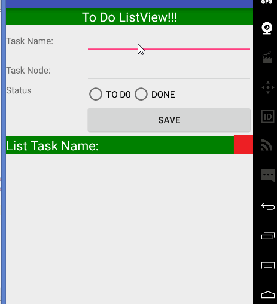

# CaoHoangQuoc
ToDoListView

An small entry demo app to join the CoderSchool.Vn's learning activity. See the Tutorial on our cliffnotes for a step-by-step tutorial.

Time spent: 18 hours implementation in total

App link: https://github.com/hoangquoc123/CaoHoangQuoc

Completed these requirements:

 Required: Successfully add and remove items from the todo list
 Required: Successfully include support for editing todo items
 Required: Persist todo items and retrieve them properly on app restart
 Required: Go through the author's details as extra information on app's logo
 Required: Able to start app in Android Studio
Notes:

Walkthrough of all functionalities:

